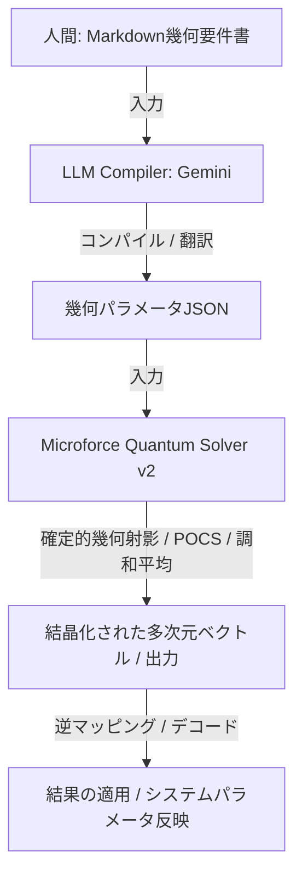

# Microforce Quantum Solver v2：システムアーキテクチャ設計書

本ドキュメントは、人間が記述する数理的・空間的要件ドキュメント（Markdown）から、多次元幾何学ソルバーが直接演算可能な形式（幾何パラメータJSON）への翻訳、および確定的ソルバーによる高速解決に至るパイプラインのアーキテクチャを定義する。

---

## 1. 全体アーキテクチャ・パイプライン

データと処理の流れは以下の通りである。LLM は非決定的な探索ソルバーではなく、純粋な**「幾何制約コンパイラ」**として機能する。



---

## 2. インターフェース定義

### 2.1 入力：要件Markdownテンプレート（人間用）
人間は以下のように、対象とする多次元空間と、そこに配置したい幾何オブジェクト（制約境界）を自然言語と簡易的な数式で定義する。

```markdown
# 幾何要件定義：高次元パラメータの協調最適化

## 1. 空間設定
*   対象空間: 5次元実数空間 $\mathbb{R}^5$。
*   境界制約: すべての次元について、値は [-10.0, 10.0] の範囲に収まること。(必須)

## 2. 幾何オブジェクト (制約領域)
*   **中心バランス拘束 (超球)**: 
    *   座標の原点 [0.0, 0.0, 0.0, 0.0, 0.0] からの距離が 5.0 以内であること。(優先度: 高)
*   **物理エネルギー保存 (超平面)**:
    *   合計値に関する等式: $x_0 + x_1 + x_2 + x_3 + x_4 = 2.0$ を完全に満たすこと。(必須)
```

### 2.2 中間表現：幾何パラメータJSON（LLMコンパイラの出力）
LLMは、上記Markdownを解析し、幾何ソルバーの数理オブジェクトに直結するパラメータ配列（AST）にコンパイルする。

```json
{
  "dimensions": 5,
  "primitives": [
    {
      "type": "BoxConstraint",
      "lower": [-10.0, -10.0, -10.0, -10.0, -10.0],
      "upper": [10.0, 10.0, 10.0, 10.0, 10.0],
      "weight": 1.0
    },
    {
      "type": "Hypersphere",
      "center": [0.0, 0.0, 0.0, 0.0, 0.0],
      "radius": 5.0,
      "weight": 0.8
    },
    {
      "type": "Hyperplane",
      "a": [1.0, 1.0, 1.0, 1.0, 1.0],
      "b": 2.0,
      "weight": 1.0
    }
  ]
}
```

---

## 3. 各モジュールの責務

### 3.1 LLM Compiler (Gemini)
*   **インプット**: 幾何要件 Markdown テキスト。
*   **アウトプット**: 幾何パラメータJSON。
*   **役割**: 自然言語の「必須」「推奨」などの優先度指示を、ソルバーの制約ウェイト（`weight`）や正しい幾何方程式（`a^T x = b` など）へ定量的に変換する。

### 3.2 Microforce Quantum Solver v2 (確定的幾何コード)
*   **インプット**: 幾何パラメータJSON。
*   **アウトプット**: 結晶化された状態ベクトル $\mathbf{x} \in \mathbb{R}^N$。
*   **役割**: JSONから対応する幾何プリミティブクラス（`Hyperplane`, `Hypersphere`, `BoxConstraint` 等）を動的に生成し、交互射影法（POCS）または調和解決（Harmonic）を用いて、高速かつ決定的に数理最適化を解く。

---

## 4. この設計がもたらすメリット

1.  **「AIガチャ」の根絶**: 
    LLMに直接数値最適化を試行させると計算ミスやブレが発生する。本構成では、数理処理自体は決定的な幾何学アルゴリズム（NumPy）が担当するため、信頼性が100%保証される。
2.  **超低レイテンシ・高スケール**: 
    LLMを呼び出すのは最初の「構造解釈」のみ。その後はローカルの高速なベクトル演算エンジンだけで推論が行われるため、即時的な応答を実現する。
3.  **高度な数理の民主化**: 
    開発者やユーザーは複雑な線形代数や最適化理論の数式を書く必要がなく、仕様書をMarkdownで記述するだけで幾何学空間での高度な協調最適化を適用できる。
