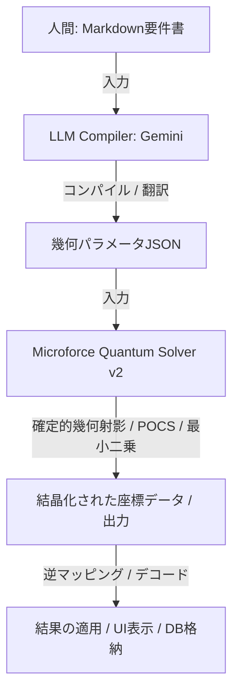

# Microforce Quantum Solver v2：システムアーキテクチャ設計書

本ドキュメントは、人間が記述する要件ドキュメント（Markdown）から、多次元幾何学ソルバーが直接演算可能な形式（幾何パラメータJSON）への翻訳、および確定的ソルバーによる高速解決に至るパイプラインのアーキテクチャを定義する。

---

## 1. 全体アーキテクチャ・パイプライン

データと処理の流れは以下の通りである。LLM は非決定的な探索ソルバーではなく、純粋な**「要件コンパイラ」**として機能する。



---

## 2. インターフェース定義

### 2.1 入力：要件Markdownテンプレート（人間用）
人間は以下のような、自然言語と簡易箇条書きによるテンプレートに基づいて要件を記述する。

```markdown
# 案件定義：店舗配置エリアの最適化

## 1. 空間設定
*   対象空間: [0, 0] から [10000, 10000] の2次元グリッド。

## 2. 配置するテナント (オブジェクト)
*   **店舗A**: 
    *   中心座標の目安: (100, 100) に位置すること。
    *   目標とする専有面積: 10000 平米。
*   **店舗B**:
    *   中心座標の目安: (150, 120) に位置すること。
    *   目標とする専有面積: 15000 平米。
*   **店舗C**:
    *   中心座標の目安: (300, 400) に位置すること。
    *   目標とする専有面積: 20000 平米。

## 3. 制約ルール
*   すべての店舗は対象空間の内側に入ること。(必須)
*   店舗同士は互いに重なり合ってはならない。(優先度: 高)
*   各店舗は、それぞれの「中心座標の目安」となる点を常に内包すること。(必須)
```

### 2.2 中間表現：幾何パラメータJSON（LLMコンパイラの出力）
LLMは、上記Markdownを解析し、幾何ソルバーに直結可能なベクトル・制約パラメータ（AST）にコンパイルする。

```json
{
  "dimensions": 2,
  "bounds": [[0.0, 10000.0], [0.0, 10000.0]],
  "objects": [
    {
      "id": 0,
      "name": "店舗A",
      "required_point": [100.0, 100.0],
      "target_area": 10000.0
    },
    {
      "id": 1,
      "name": "店舗B",
      "required_point": [150.0, 120.0],
      "target_area": 15000.0
    },
    {
      "id": 2,
      "name": "店舗C",
      "required_point": [300.0, 400.0],
      "target_area": 20000.0
    }
  ],
  "constraints": [
    {
      "type": "boundary_limit",
      "weight": 1.0
    },
    {
      "type": "point_containment",
      "weight": 1.5
    },
    {
      "type": "non_overlap",
      "weight": 2.0
    },
    {
      "type": "area_scaling",
      "weight": 1.0
    }
  ]
}
```

---

## 3. 各モジュールの責務

### 3.1 LLM Compiler (Gemini)
*   **インプット**: Markdown テキスト。
*   **アウトプット**: 厳密なスキーマに準拠した幾何パラメータJSON。
*   **役割**: 自然言語の曖昧な優先度（例：「〜が望ましい」「必須」）を、ソルバーの制約ウェイト（`weight`）へと定量的にマッピングする。

### 3.2 Microforce Quantum Solver v2 (確定的コード)
*   **インプット**: 幾何パラメータJSON。
*   **アウトプット**: 状態ベクトル $\mathbf{x}$ の確定値（各長方形の座標）。
*   **役割**: JSONから動的に射影演算関数（$P_k$）を構築し、交互射影（POCS）または調和解決（Harmonic）を用いて、高速かつ決定的に数理最適化を解く。

---

## 4. この設計がもたらすメリット

1.  **「AIガチャ」の根絶**: 
    LLMに直接コードを生成させたり、解を直接推論させたりすると「確率的なブレ」が発生する。本構成では、解の計算自体は100%確定的なコードが行うため、計算結果がブレない。
2.  **超低レイテンシ**: 
    LLMを呼び出すのは最初の「要件解釈（コンパイル）」の1回のみ。その後はローカルの高速な幾何ソルバーだけで推論が行われるため、インタラクティブで即時的なUXを実現できる。
3.  **記述の容易さ**: 
    人間は複雑な数式や最適化アルゴリズムを一切意識することなく、親しみやすいMarkdown形式の仕様書を書くだけで、高度な数理最適化の恩恵を受けられる。
