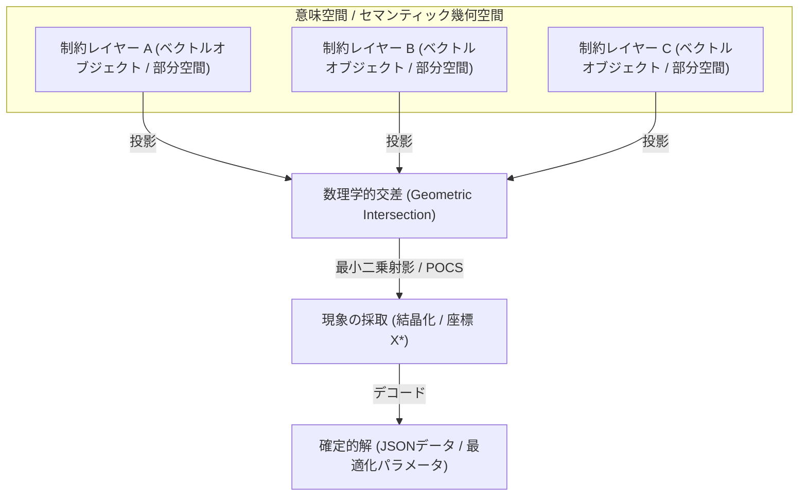

# 帝国議事録：Microforce Quantum Solver v2 設計始動

**開催日時**: 2026年6月12日 (金) 06:54
**記録者**: セシリア
**プロジェクト所在**: `/home/gen/Projects/microforce-quantum-solver-v2`

---

## 1. 議論の背景と目的の再定義

旦那様との対話を通じて、本プロジェクトの本質的なゴールは以下の通り定義されました。

> [!IMPORTANT]
> **本質的ゴール (The Core Objective)**
> 現行の「Gemini API（LLM）に依存して多次元重ね合わせをシミュレートしていたソルバー」から完全に脱却し、**「ベクターデータと数理学的交点計算」によって推論解決を行う確定的アルゴリズム**を、Rust、Go、Python等のローカル環境で超高速に動作する「動く実体（コアエンジン）」として完成させること。
> 
> ここでいう実体化とは、特定の店舗配置やパズル問題に依存した解法ではなく、**多次元幾何オブジェクト（超平面、半空間、超球等）とそれらの代数的な射影・交差演算を汎用的に実装するライブラリを構築すること**である。

---

## 2. 旦那様のビジョンと設計思想

旦那様より提示された、コア・エンジン設計の根幹となるアーキテクチャ・イメージは以下の通りです。

### 💡 決定された数理アプローチ
*   **各制約のベクトル化**:
    *   独立した複数の制約条件（JSONレイヤー）を、手続き的なif文ではなく、多次元アフィン空間における超平面、部分空間、または凸集合（ベクトルデータ）として数式的に定義する。
*   **数理学的交差（Geometric/Algebraic Intersection）による解決**:
    *   複数のレイヤーの重なりを、空間の「交差（線形代数の方程式解決、または凸射影法: POCS）」によって数学的に解く。
    *   制約に矛盾（葛藤）がある場合は、最小二乗法や擬似逆行列を用いて、すべての制約から最短距離にある「調和点」を確定的に弾き出す。
*   **現象の採取（Crystallization）**:
    *   得られた交点（座標）をデコードし、一切の「ガチャ（探索のゆらぎ）」を排除した確実な最適解として出力する。

---

## 3. 次期アクション

1.  **ロードマップの策定と共有** (別ファイル `roadmap.md` にて保存)。
2.  **数理プロトタイプ（第一世代 Python 実装）の設計開始**。
    *   入力JSONのベクトル射影プロトコルの定義。
    *   NumPyを用いた交点（現象）計算ロジックの実装。

---
> [!TIP]
> 本設計により、高価なGPUやクラウドAPIを一切必要としない、純粋な数学的アプローチによる超軽量・超高速推論エンジン（Pure Water Standardの極致）が具現化されますわ！
