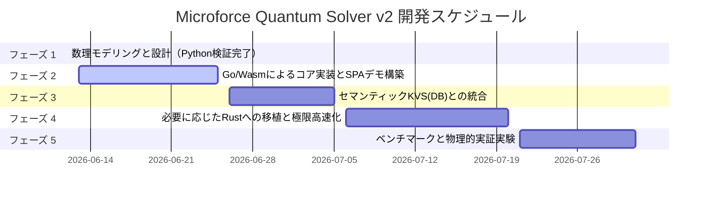

# Microforce Quantum Solver v2 開発ロードマップ

本ドキュメントは、多次元幾何学およびベクターデータ交差による確定的推論ソルバー「Microforce Quantum Solver v2」を、Go言語/WebAssembly（Wasm）ベースのドメインフリーで高速実行可能な幾何代数ライブラリとして実体化させるための開発計画です。

---

## 📅 ロードマップ概要

---

## 🛠️ 各フェーズの詳細設計

### 🌌 フェーズ 1：数理モデリングと幾何表現の定義（完了）
*   **目標**: 任意の制約条件を「多次元アフィン空間」および「凸集合」として定義するための数理モデルを確立し、Pythonで動作性を数理検証する。
*   **タスク（完了）**:
    1.  **セマンティック射影スキーマの定義**:
        *   高次元実数ベクトル空間 $\mathbb{R}^D$ 上の幾何オブジェクトへの変換スキーマ設計。
    2.  **数理学的交差（Intersection）の代数方程式化**:
        *   凸集合への交互射影法（POCS）および平均射影法（Harmonic）の実装。
    3.  **Pythonによる実証検証**:
        *   [`test_geometry.py`](file:///home/gen/Projects/microforce-quantum-solver-v2/test_geometry.py) にて、3D平面交差、2D非交差調和、10D複合制約が数イテレーションで確定的に収束することを確認。

### 🐹 フェーズ 2：Go / Wasm によるコアロジック実装とSPAデモ（6月中旬〜下旬）
*   **目標**: ピュアGoで幾何ソルバーを記述し、Wasmにビルドしてブラウザ上で即座に動作するビジュアルデモを構築する。
*   **タスク**:
    1.  **ピュアGoによる幾何オブジェクト・射影関数の実装**:
        *   スライスアロケーションの極小化（GC回避）を考慮した、`Hyperplane`, `HalfSpace`, `BoxConstraint`, `Hypersphere`, `AffineSubspace` のGo構造体設計。
    2.  **WebAssemblyビルド環境の設定**:
        *   `wasm_exec.js` を用いた Go ➔ JS 間のデータブリッジ実装。
        *   標準GoおよびTinyGoでのビルドパイプラインの構築。
    3.  **ブラウザSPAデモの構築**:
        *   HTML5 Canvas / Vanilla CSS / JS を用いて、ソルバーが多次元制約を引き込み・調和解決していく軌跡を視覚的に観測できるデモ画面 of 作成。

### 🗄️ フェーズ 3：セマンティックKVS（MicroforceDB v3）との統合（6月下旬〜7月上旬）
*   **目標**: データベースとソルバーを直結し、「データストア ➔ 推論解決 ➔ 結果反映」をローカルで完結させる。
*   **タスク**:
    1.  **Layer-based I/Oの直結**:
        *   SQLite（Cecilia V3 DB）に格納されているレイヤーデータをGoモジュール経由で読み込み、ソルバーの幾何オブジェクトにデコードして実行、結果を再びDBへ書き戻すパイプラインの構築。
    2.  **スキーマ・バリデータとの統合**:
        *   ソルバーが排出した構造化データが、DBのASTベースの制約ルールに違反していないか自動検証する仕組みとの結合。

### 🦀 フェーズ 4：必要に応じたRustへのコア移植と極限高速化（7月上旬〜中旬）
*   **目標**: 計算の次元数やオブジェクト数が膨大になった場合のボトルネックを解消するため、Goの実績コードをRustへ高速移植する（エスケープハッチ）。
*   **タスク**:
    1.  **Rust（`nalgebra` / `ndarray`）への幾何コアの移植**:
        *   静的ライフタイム、ゼロコピー設計による極限の浮動小数点演算スピードの追求。
    2.  **SIMD命令を用いたベクトル並列演算の最適化**:
        *   コンパイラレベルでのSIMD有効化による並列直交射影処理の超高速化。

### 📊 フェーズ 5：ベンチマークと物理的実証実験（7月下旬〜）
*   **目標**: 既存の一般的な非線形・線形最適化ソルバーと対決させ、本幾何学ソルバーが「計算時間」と「メモリ効率」において圧倒的な性能を両立していることを証明する。
*   **タスク**:
    1.  多様な高次元制約充足問題における、標準的なQPソルバー（二次計画法）やシンプレックス法、勾配降下法との実行時間・収束性のベンチマーク計測。
    2.  結果をZennや技術文書として精製し、技術的エビデンスとして公開。

---

> [!NOTE]
> 各フェーズの進捗、および実装時に発生した数理的課題は、適宜このディレクトリの `development_log.md` に追記していきますわ！
