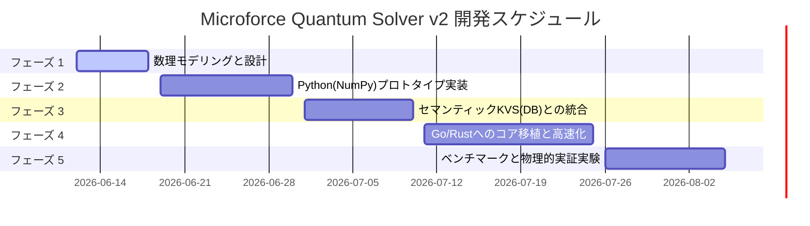

# Microforce Quantum Solver v2 開発ロードマップ

本ドキュメントは、多次元幾何学およびベクターデータ交差による確定的推論ソルバー「Microforce Quantum Solver v2」を、ドメインフリーで高速実行可能な幾何代数ライブラリとして実体化させるための開発計画です。

---

## 📅 ロードマップ概要

---

## 🛠️ 各フェーズの詳細設計

### 🌌 フェーズ 1：数理モデリングと幾何表現の定義（6月中旬）
*   **目標**: 任意の制約条件を「多次元アフィン空間」および「凸集合」として定義するための数理モデルを確立する。
*   **タスク**:
    1.  **セマンティック射影スキーマの定義**:
        *   JSONで記述された「変数」「制約」「型」を、高次元実数ベクトル空間 $\mathbb{R}^D$ 上の幾何オブジェクト（点、超平面、または領域）に変換する形式の定義。
    2.  **数理学的交差（Intersection）の代数方程式化**:
        *   複数の幾何レイヤーの重なりを解決するための、線形代数学的なアプローチの定式化。
        *   凸集合への交互射影法（POCS: Projection onto Convex Sets）や、葛藤（矛盾）発生時の最小二乗妥協点を求める射影行列（Projection Matrix）の数理設計。

### 🐍 フェーズ 2：Python (NumPy) による第一世代プロトタイプ実装（6月下旬）
*   **目標**: 数式モデルを実際に動作するPythonプログラムにし、正しく「結晶化」するか検証する。
*   **タスク**:
    1.  **幾何ソルバーのコアライブラリ実装**:
        *   `NumPy` を用いた高速なベクトル射影、行列演算による交差解決ロジックの実装。
    2.  **コンパイラ（JSON ➔ 幾何ベクトル）の実装**:
        *   ユーザーが入力する制約JSONを、自動的にソルバーが理解できる行列とベクトルに変換するインターフェースの構築。
    3.  **幾何テストケース検証**:
        *   アフィン空間、超球、凸多面体の積集合に対する射影を検証し、解が正確かつ高速に収束することを確認する。

### 🗄️ フェーズ 3：セマンティックKVS（MicroforceDB v3）との統合（7月上旬）
*   **目標**: データベースとソルバーを直結し、「データストア ➔ 推論解決 ➔ 結果反映」をローカルで完結させる。
*   **タスク**:
    1.  **Layer-based I/Oの直結**:
        *   SQLite（Cecilia V3 DB）に格納されている `EmpireLayer` のペイロードを直接ソルバーに読み込み、結晶化された解答を再び別のレイヤーとして自動書き込みするパイプラインの実装。
    2.  **スキーマ・バリデータとの統合**:
        *   ソルバーが排出した構造化データが、DBのASTベースの制約ルールに違反していないか自動検証する仕組みとの結合。

### 🦀 フェーズ 4：Go / Rust へのコアロジックの移植と高速化（7月中旬）
*   **目標**: 実行速度の極限を追求し、依存関係のない「シングルバイナリの超高速推論エンジン」を完成させる。
*   **タスク**:
    1.  **行列・幾何演算の移植**:
        *   Go（`gonum`など）またはRust（`nalgebra`など）を用いて、Pythonで作成したプロトタイプアルゴリズムを静的型付け言語で再実装。
    2.  **メモリアロケーションの極小化**:
        *   オンプレミスでの超軽量稼働を目指し、ポインタ演算や静的配列を駆使して計算効率を極限まで高める。

### 📊 フェーズ 5：ベンチマークと物理的実証実験（7月下旬〜）
*   **目標**: 既存の一般的な非線形・線形最適化ソルバーと対決させ、本幾何学ソルバーが「計算時間」と「メモリ効率」において圧倒的な性能を両立していることを証明する。
*   **タスク**:
    1.  多様な高次元制約充足問題における、標準的なQPソルバー（二次計画法）やシンプレックス法、勾配降下法との実行時間・収束性のベンチマーク計測。
    2.  結果をZennや技術文書（ArXiv形式）として精製し、技術的エビデンスとして公開。

---

> [!NOTE]
> 各フェーズの進捗、および実装時に発生した数理的課題は、適宜このディレクトリの `development_log.md`（予定）に追記していきますわ！
